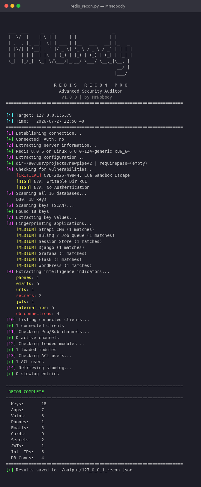

# MrNobody Redis Recon Pro

<p align="center">
  
</p>

<p align="center">
  <strong>Advanced Redis Security Audit & Reconnaissance Tool</strong>
</p>

<p align="center">
  
  
  
  
</p>

---

## Overview

**MrNobody Redis Recon Pro** is a comprehensive security research tool for auditing Redis instances. It performs a full **14-phase deep reconnaissance** to identify misconfigurations, exposed data, vulnerabilities, and application fingerprints.

### Zero Dependencies
This tool uses **raw RESP protocol over TCP sockets** — no `redis-py`, no `pip install`, no external libraries. Just pure Python 3.

---

## Features

### 14-Phase Reconnaissance

| Phase | Description |
|-------|-------------|
| 1 | **Connection** — TCP connect + AUTH validation |
| 2 | **Server INFO** — Version, OS, uptime, memory, persistence |
| 3 | **CONFIG** — Full configuration dump (dir, requirepass, maxmemory) |
| 4 | **Vulnerabilities** — CVE detection + misconfig warnings |
| 5 | **Database Scan** — All 16 databases key counts |
| 6 | **Key Enumeration** — SCAN all keys (non-blocking) |
| 7 | **Value Extraction** — Full key values with type detection |
| 8 | **App Fingerprinting** — Identify 13+ known applications |
| 9 | **Intel Extraction** — Phones, emails, cards, secrets, JWTs, IPs |
| 10 | **Client List** — Connected client details |
| 11 | **Pub/Sub** — Active channels |
| 12 | **Modules** — Loaded Redis modules |
| 13 | **ACL Users** — User accounts |
| 14 | **Slowlog** — Recent slow queries |

### Vulnerability Detection

- **CVE-2025-49844** — Lua Sandbox Escape
- **CVE-2022-0543** — Debian/Ubuntu Lua Escape
- **Module Loading RCE** — Malicious `.so` loading
- **Writable Dir RCE** — SSH/cron injection via CONFIG SET
- **No Authentication** — Missing `requirepass`

### Application Fingerprinting

Detects: Evolution API, New API/One API, Strapi CMS, BullMQ, Django, Keycloak, Grafana, Express.js, Flask, Nextcloud, Magento, WordPress, Session Stores.

### Intelligence Extraction

- Phone numbers (international format)
- Email addresses
- Credit card numbers (Luhn-validated with brand detection)
- URLs
- Secrets/API keys/passwords/tokens
- JWT tokens
- Internal IP addresses
- Database connection strings (postgres/mysql/mongodb/redis)
- Automatic base64 decoding

---

## Installation

### Requirements
- Python 3.6+
- **No pip install needed** — zero external dependencies

### Download
```bash
git clone https://github.com/MrNobody/redis-recon-pro.git
cd redis-recon-pro
chmod +x redis_recon.py
```

---

## Usage

### Basic Scan
```bash
python3 redis_recon.py -t 192.168.1.100
```

### With Authentication
```bash
python3 redis_recon.py -t 10.0.0.5 -a mypassword
```

### Custom Port
```bash
python3 redis_recon.py -t example.com -p 6380
```

### Save Results to Custom Directory
```bash
python3 redis_recon.py -t 192.168.1.100 -o ./scan_results
```

### Disable Colors (for logging)
```bash
python3 redis_recon.py -t 192.168.1.100 --no-color
```

### Full Help
```bash
python3 redis_recon.py --help
```

### CLI Options

| Flag | Description | Default |
|------|-------------|---------|
| `-t, --host` | Target Redis host (required) | — |
| `-p, --port` | Redis port | 6379 |
| `-a, --auth` | Redis password | None |
| `-o, --output` | Output directory for JSON | `./output` |
| `--no-color` | Disable colored output | False |
| `--version` | Show version | — |

---

## Output

Results are saved as JSON:
```
output/
└── 192_168_1_100_recon.json
```

The JSON contains all 14 phases of data: server info, config, vulnerabilities, databases, keys, applications, intelligence, clients, pubsub, modules, ACL, slowlog.

---

## Sample Output

```
[*] Target: 192.168.1.100:6379
[*] Time:   2026-07-27 18:30:00
======================================================================
[1] Establishing connection...
[+] Connected! Auth: no
[2] Extracting server information...
    Redis 7.4.2 on Linux
[3] Extracting configuration...
    dir=/etc/redis | requirepass=(empty)
[4] Checking for vulnerabilities...
    [HIGH] N/A: No Authentication
    [HIGH] N/A: Writable Dir RCE
[5] Scanning all 16 databases...
    DB0: 347 keys
[6] Scanning keys (SCAN)...
    Found 347 keys
...
======================================================================
 RECON COMPLETE
======================================================================
  Keys:       347
  Apps:       2
  Vulns:      2
  Phones:     156
  Emails:     12
  Secrets:    8
======================================================================
```

---

## Use Cases

- **Security Auditing** — Audit your Redis instances for misconfigurations
- **Penetration Testing** — Reconnaissance during authorized pentests
- **Compliance** — Verify Redis security posture (PCI-DSS, SOC2)
- **Bug Bounties** — Identify exposed Redis instances
- **CTF Challenges** — Extract flags from Redis challenges
- **Training** — Learn Redis security concepts

---

## Disclaimer

This tool is provided for **educational and authorized testing purposes only**. Use only against systems you own or have explicit written permission to test. The author assumes no responsibility for misuse.

---

## License

MIT License — see [LICENSE](LICENSE) file.

---

## Author

**MrNobody**

Version: 1.0.0
